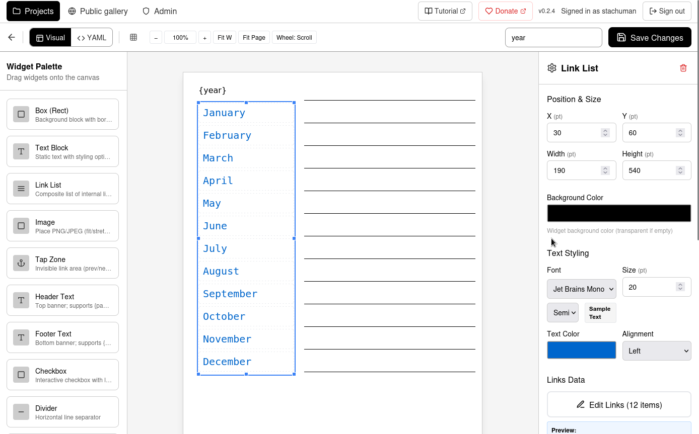

# E-ink PDF Templates

Create beautiful, interactive PDF planners and templates optimized for e-ink devices. Visual editor, public gallery, and professional PDF generation.



**[Live Demo](https://eink.cgpsmapper.com)** | **[Tutorial](TUTORIAL.md)** | **[Example Template](https://eink.cgpsmapper.com/gallery/id/b08c7186-c465-40e8-b7c3-b46b95eb1edd)**

---

## Features

### Visual Editor
- **Drag-and-drop** interface for designing templates
- **Real-time preview** with WebSocket updates
- **15+ widget types**: calendars, tables, day lists, checkboxes, text blocks, images, links, and more
- **Snap-to-grid** and alignment tools

### Template System
- **Master templates** - reusable page layouts
- **Plan system** - parametric configurations with variables
- **Compilation rules** - generate year planners, monthly calendars, weekly spreads
- **Internal navigation** - bookmarks, links between pages, destinations

### Device Optimization
- **27 device profiles** for Boox, reMarkable, Kindle, Kobo, Supernote
- **Constraint enforcement** - minimum font sizes, touch targets, stroke widths
- **Auto-fix mode** - automatically adjust designs to meet device constraints
- **Easy to add** new devices via YAML configuration

### Public Gallery
- **Share templates** with the community
- **One-click cloning** - copy any public template to your workspace
- **Rescale to any device** - adapt templates to different screen sizes
- **Download PDFs** directly from gallery

### Multi-User Platform
- **User accounts** with secure JWT authentication
- **Project management** with versioning
- **Private workspace** for your templates
- **Clone tracking** - see how popular your shared templates are

---

## Quick Start (Docker)

```bash
# Clone and start
git clone https://github.com/stachuman/boox-template-generator.git
cd boox-template-generator
docker compose up -d

# Access at http://localhost:3000
```

### First Steps
1. **Register** at `/register`
2. **Create project** from dashboard
3. **Design template** with visual editor
4. **Compile & download** your PDF
5. **Share** to public gallery

---

## Supported Devices

**27 device profiles** included:

| Brand | Devices |
|-------|---------|
| **Boox** | Go Color 7, Note Air 3C/4C, Tab Mini C, Tab Ultra C, Page, Max 13, Go 10.3 |
| **reMarkable** | reMarkable 2, Paper Pro |
| **Kindle** | Scribe, Paperwhite |
| **Kobo** | Elipsa 2E, Sage, Clara 2E, Libra 2 |
| **Supernote** | A5X, A6X, Manta, Nomad |

Portrait and landscape variants available. Easy to add custom profiles.

---

## Widget Types

- **Content**: Text blocks, images, tables, day lists
- **Planning**: Monthly calendars, weekly views, ruled lines, dot grids
- **Navigation**: Internal links, tap zones, link lists
- **Forms**: Checkboxes, text inputs
- **Layout**: Dividers, vertical lines, boxes

---

## Configuration

### Environment Variables
```bash
FRONTEND_PORT=3000              # Web interface port
EINK_DATA_DIR=/app/backend/data # User data storage
EINK_CLEANUP_TTL_DAYS=14        # Auto-cleanup (0 to disable)
JWT_SECRET_KEY=your-secret-key  # Auto-generated if not set
```

### Docker Compose Override
```yaml
# docker-compose.override.yml
services:
  frontend:
    ports:
      - "8080:80"  # Custom port
```

---

## Development

```bash
# Backend
python -m venv einkpdf-env && source einkpdf-env/bin/activate
pip install -e .[dev]
uvicorn backend.app.main:app --reload --port 8000

# Frontend
cd frontend && npm ci && npm run dev
```

### Tech Stack
- **Frontend**: React 18, TypeScript, Tailwind CSS, Zustand
- **Backend**: FastAPI, ReportLab, PyMuPDF, Pydantic
- **Infrastructure**: Docker, Nginx, WebSocket

---

## Contributing

1. Fork the repository
2. Create feature branch: `git checkout -b feature/amazing-feature`
3. Follow coding standards in `CLAUDE.md`
4. Submit pull request

**Issues**: [GitHub Issues](https://github.com/stachuman/boox-template-generator/issues)

---

## Support

This project is **free and open source**. If you find it useful:

**[Donate via PayPal](https://paypal.me/StachuMan)**

Your support helps maintain and improve the project!

---

## License

**AGPL-3.0-or-later** - Free software that ensures freedom for all users.

---

**[Repository](https://github.com/stachuman/boox-template-generator)** | **[Demo](https://eink.cgpsmapper.com)** | **[Tutorial](TUTORIAL.md)**

Built with React + FastAPI + ReportLab | Version 0.2.1
